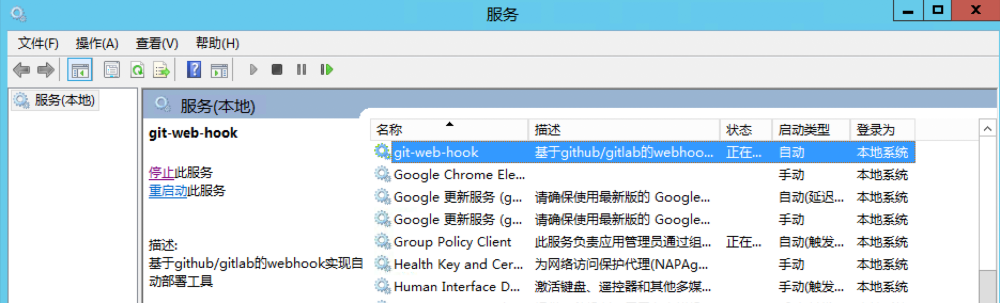
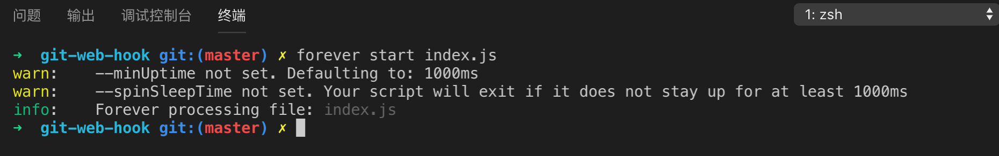
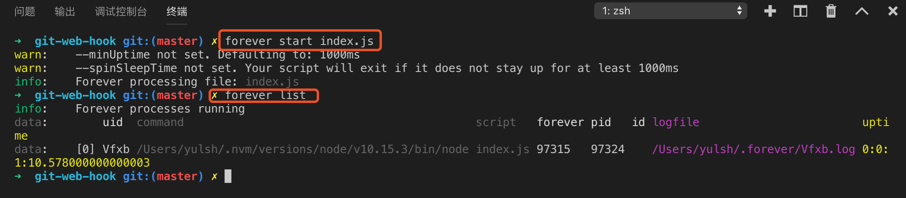
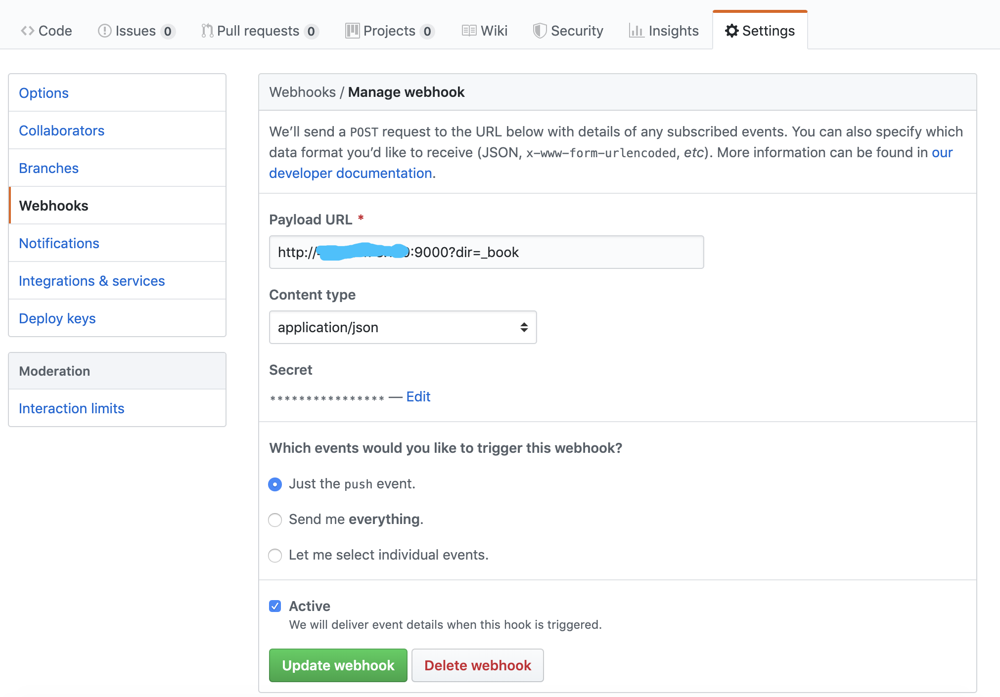
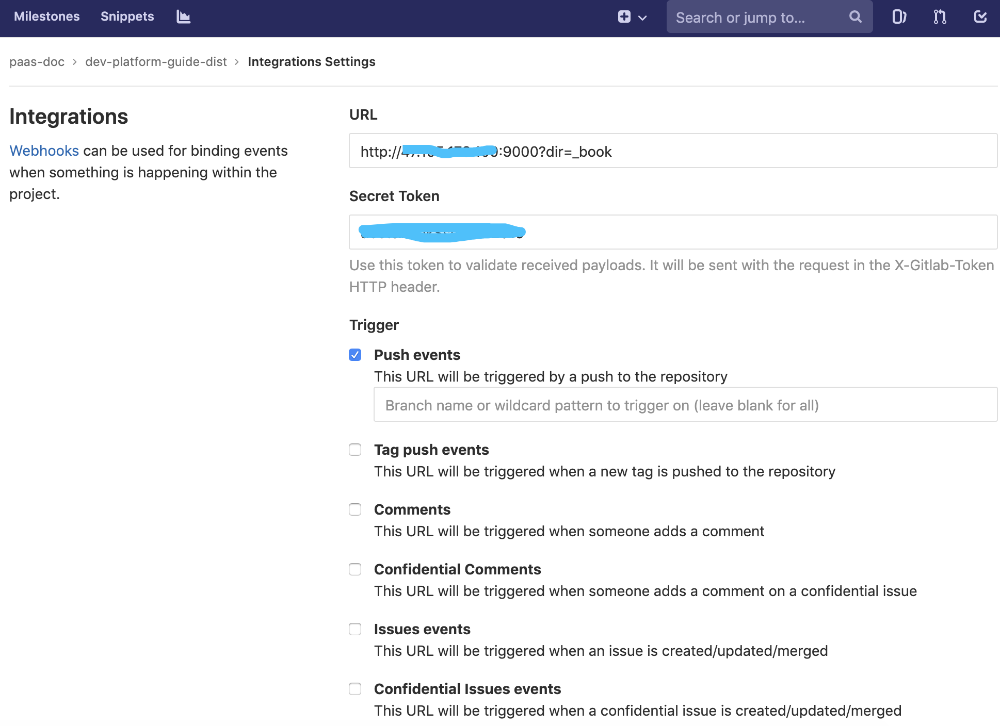

# git-web-hook

基于 github/gitlab webhook 实现自动化部署工具。

# 背景

常用 gitbook 编写文档，每次文档内容有更新，流程是这样的：

1. 编写文档;
2. 在目录下执行`gitbook build`编译出静态资源(_book)；
3. 将静态资源拷贝到云服务器上;
4. 把原始文档再提交到 github/gitlab 上；
5. 完成文档更新；

整个过程较为繁琐，为了解决这个问题，借助于 `webhook` 来实现，理想流程如下: 

1. 编写文档;
2. 在目录下执行`gitbook build`编译出静态资源(_book)；
3. 把原始文档以及编译出的静态资源(_book)一并提交到仓库中(触发 Webhook Push Event)；
4. 完成文档更新；

抽象一下，这是一个自动化部署的过程，使用 `Jenkins`等开源产品显得有点重，于是,基于`nodejs`写了个轻量级的 `git-web-hook` 来简化部署流程。期望达到的效果：设置好部署规则的前提下，只需要提交代码，剩下的事情交给工具来做。

# 特性
* 支持 github & gitlab;
* 支持通过 url 自定义部署路径;
* 支持自定义资源拷贝路径；
* 支持拷贝完成后执行相关脚本；(实现中)

假设您已经安装好了`git`并且配置好了`SSH-KEY`。

# 服务器部署
该工具支持在 windows, linux, mac 下部署。在windows下建议安装成`windows 服务`，确保在系统注销重启后能够自动启动。

```bash
// 克隆仓库
git clone git@github.com:tonyyls/git-web-hook.git

// 进入目录
cd git-web-hook
```

## 修改配置 config.json

```
{
    "port": "9000", 
    "localRepo": "/Users/yulsh/Downloads/git-repo",
    "repository": [
        {
            "url": "git@gitlab.bingosoft.net:paas-doc/dev-platform-guide-source.git",
            "deployPath": "/Users/yulsh/Downloads/dev-platform"
        }
    ]
}

```

* port: 服务端口
* localRepo: 本地存放仓库代码的地方，当前工具将会从 github/gitlab 上拉取代码存放在此，之后按需拷贝到 `deployPath` 中
* url: 需要对接 webhook 的仓库，支持SSH或者https
* deployPath: 目标部署位置


## windows
在 windows 下部署，需要额外安装 `node-windows`。进入到仓库目录：

```bash
// 安装依赖
npm install

// 安装windows下的依赖
npm install node-windows -D

```
待安装完成后，即可运行 `deploy/install.js` 进行安装服务

安装:

```
node deploy/install.js
```
卸载:

```
node deploy/uninstall.js

```

待安装成功后，可以在服务中看到真正运行的 `git-web-hook`




## mac / linux


在mac或者linux下，可以选择使用 [forever](https://www.npmjs.com/package/forever) 或者 [pm2](https://www.npmjs.com/package/pm2) 来实现在后台运行 nodejs 程序。

全局安装 forever

```
npm install forever -g
```

启动index.js

```
forever start index.js
```


启动成功后，可以通过如下命令查看进程状态:

```
forever list

```


# 仓库配置

服务器端部署好后，会得到一个地址: 例如 `http://ip:port/`。

## github 中配置webhook

进入仓库主页 > Settings > Webhooks > Add webhook



Payload URL:

PUSH 事件触发后的请求地址，该地址可以指定`上下文地址`以及`查询参数`，服务端接收到后将会做出相应处理。
举个例子:  http://10.201.76.142:9000/root/website?dir=_book

其中`root/website` 是部署的上下文路径，会拼接到上面的 config.json 的 `deployPath`中，最后部署路径: `/Users/yulsh/Downloads/dev-platform/root/website`。另外,`dir=_book`可以指定拷贝仓库的哪个目录，例如只拷贝`_book`目录的静态资源，如不设置将全部拷贝。

Content type: 设置为 application/json

Secret: 设置请求密钥

## gitlab 中配置webhook

进入仓库主页 > Settings > Integrartions



其他配置与 github 类似。Enjoy!